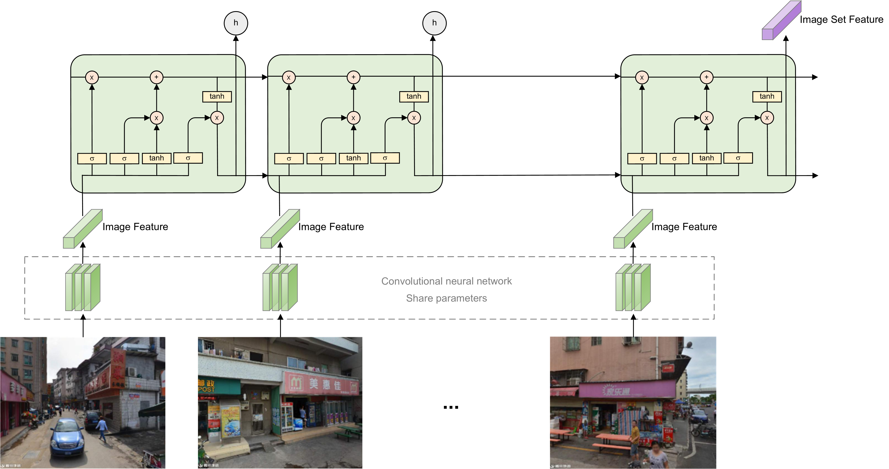

# Vision-LSTM
Authors: Yingjing Huang, Fan zhang, Yong Gao, Wei Tu, Fabio Duarte, Carlo Ratti, Diansheng Guo, Yu Liu

## Abstract
Street-level imagery has emerged as a valuable tool for observing large-scale urban spaces with unprecedented detail. However, previous studies have been limited to analyzing individual street-level images. This approach falls short in representing the characteristics of a spatial unit, such as a street or grid, which may contain a varying number of street view images ranging from several to hundreds. As a result, a more comprehensive and representative approach is required to capture the complexity and diversity of urban environments at different spatial scales. To address this issue, this study proposes a deep learning-based module called **Vision-LSTM**, which can effectively **obtain vector representation from varying numbers of street-level images in spatial units**. The effectiveness of the module is validated through experiments to recognize urban villages, achieving reliable recognition results (overall accuracy: 91.6\%) through multimodal learning that combines street-level imagery with remote sensing imagery and social sensing data. Compared to existing image fusion methods, Vision-LSTM demonstrates significant effectiveness in capturing associations between street-level images. The proposed module can provide a more comprehensive understanding of urban space, enhancing the research value of street-level imagery and facilitating multimodal learning-based urban research. Our models are available at https://github.com/yingjinghuang/Vision-LSTM.



## Citation
<!-- **If you find the resource useful, please cite the following :- )** -->
```bibtex
@article{HUANG2023102043,
title = {Comprehensive urban space representation with varying numbers of street-level images},
journal = {Computers, Environment and Urban Systems},
volume = {106},
pages = {102043},
year = {2023},
issn = {0198-9715},
doi = {https://doi.org/10.1016/j.compenvurbsys.2023.102043},
url = {https://www.sciencedirect.com/science/article/pii/S0198971523001060},
author = {Yingjing Huang and Fan Zhang and Yong Gao and Wei Tu and Fabio Duarte and Carlo Ratti and Diansheng Guo and Yu Liu},
keywords = {Street-level imagery, Urban space representation, Multimodal data fusion, Deep learning, Urban village recognition}
```

## Highlights
- Representing regional features by capturing associations among street-level images.
- The proposed Vision-LSTM extract features from varying numbers of images.
- Multimodal model fused satellite imagery, street-level imagery, and mobility data.
- Both visual and dynamic mobility information crucial for urban village recognition.
- The framework achieved 91.6% accuracy in identifying urban villages.

## Results
In our urban village recognition case, the results can be seen in the following table.

| Method                                   | OA(%)     | Kappa     | F1        |
|------------------------------------------|-----------|-----------|-----------|
| No fusion (random image)                 | 88.1      | 0.634     | 0.708     |
| Average Pooling                          | 89.1      | 0.656     | 0.727     |
| Maximum Pooling                          | 79.3      | 0.461     | 0.588     |
| Element-wise Sum                         | 77.4      | 0.432     | 0.566     |
| **Vision-LSTM (proposed in this study)** | **91.6**  | **0.720** | **0.773** |

## Setup
Will update with a requirement file.

## Usage
**Step 1**. Prepare your own datasets.

**Step 2**. Run the [preprocess.py](preprocess.py) to preprocess data.
```bash
python preprocess.py
```

**Step 3**. Revise the configs in [configs.py](configs.py).

**Step 4**. Train your own model.
```bash
python train.py
```
